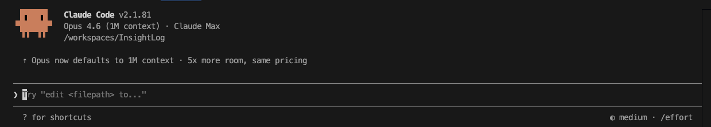

# 環境セットアップの仕方

## 研修受講者向け（ZIPパッケージ配布の場合）

### 前提条件

以下のソフトウェア/拡張機能が PC にインストール済みであることを確認してください。

- **Visual Studio Code**（VS Code）
  - **Dev Containers 拡張機能**（VS Code 内の拡張機能から「Dev Containers」を検索してインストール）
- **Docker Desktop**

---

### 手順

#### 1. ZIP ファイルを解凍する

配布された ZIP ファイル（InsightLog_xxxx.zip）を任意の場所（ご自身のワークスペース）に解凍します。

#### 2. VS Code でフォルダを開く

Visual Studio Code を起動し、解凍したフォルダを開きます。
（「ファイル」→「フォルダーを開く」から選択）

#### 3. Dev Container でコンテナを起動する

画面右下にポップアップが表示されるので「**Reopen in Container**」を選択します。
表示されない場合は、コマンドパレット（`F1` または `Shift+⌘+P`）から「Dev Containers: Reopen in Container」を実行してください。

> **エラーが出る場合**: Docker Desktop が起動していない可能性があります。
> Docker Desktop を開いてから、再度「Reopen in Container」を実行してください。

#### 4.（初回のみ）構成の選択

初回起動時に選択肢が表示される場合があります。以下のように選択してください。

1. 「**Add configuration to workspace**」を選択
2. 「**Default Linux Universal**」を選択
3. 以降の選択肢は**何も選択せずに「OK」**を押してください

コンテナのビルドが始まります。完了するまでしばらくお待ちください。

#### 5. セットアップスクリプトを実行する

コンテナの構築が完了したら、VS Code 内でターミナルを開き（`Shift+Ctrl+@`）、以下を実行します。

```bash
bash ./setup.sh
```

表示される 8 桁のワンタイムコードをブラウザに入力し、配布された GitHub アカウントで GitHub との連携を許可してください。

#### 6. Claude Code を起動・認証する

ターミナルで以下を実行します。

```bash
claude
```

起動後、いくつかの選択肢が表示されます。

1. **mode の選択** — お好みのモードを選択してください
2. **課金方式の選択** — 「**Anthropic API usage...**」を選択
3. **ブラウザ認証** — ターミナルに表示される URL を開き、ブラウザで認証画面に進みます
4. **メールアドレスの入力** — 認証画面の email フォームに以下を入力し、「有効メールを送信」を押します
   ```
   expart-ax@g-wartes.net
   ```
5. **CS（カスタマーサポート）での承認** — 送信された有効化メールを CS 側で承認します

#### 7. セットアップ完了

ログインに成功すると API が連動します。以降の確認ダイアログでは基本的に「**yes**」を選択してください。

以下のような画面が表示されたらセットアップ完了です。



## トラブルシューティング

### ディスク容量エラーが出る場合
Dev Container の `/home/node` は Docker overlay FS で容量が限られています。`devcontainer.json` の `remoteEnv` でキャッシュ系ディレクトリをワークスペース配下に設定済みですが、問題が出た場合:

```bash
# npm キャッシュを削除してスペース確保
npm cache clean --force
```

### GitHub 認証に失敗する場合
```bash
# 手動で認証をやり直す
gh auth login --hostname github.com --git-protocol https --web
gh auth setup-git
```
